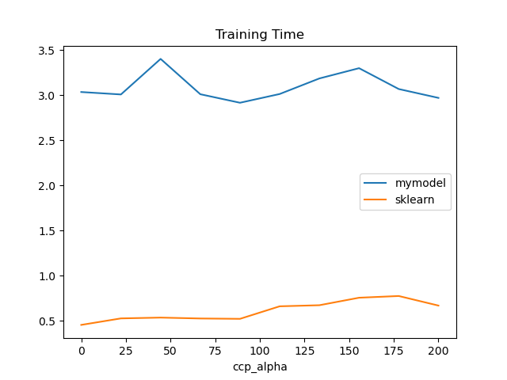
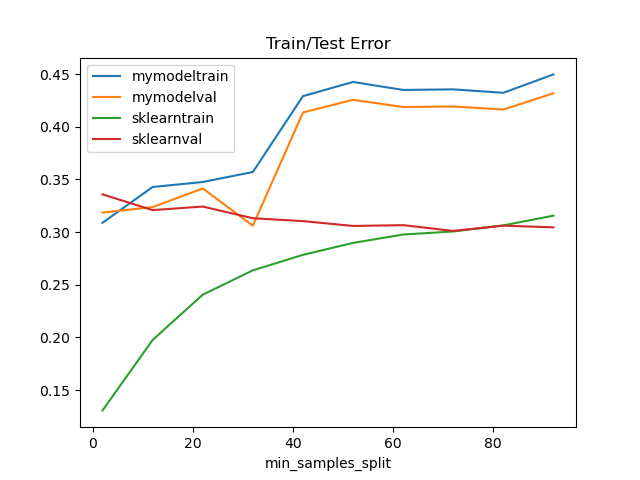
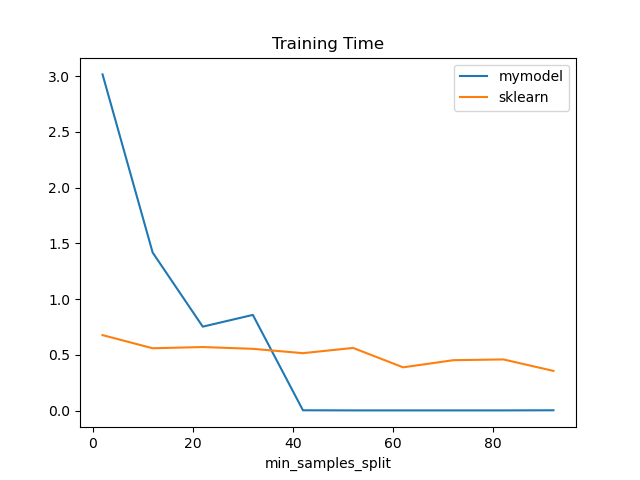
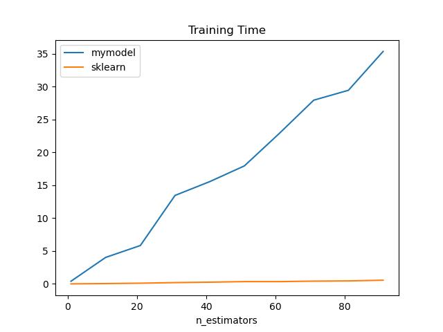

# Random Forest from Scratch
This project tries to recreate the random forest regressor model of sklearn as a programming exercise. 
The created model is then benchmarked together with the standard regressor from sklearn to see how succeessful the implementation was in comparison.
As a final point, I want to analyze how sklearns implementation differs from mine and how that results in the benchmark differences.

# Benchmarks

# Datasets
First we compare the base performance of both models with three datasets:

# Parameters
We test the behaviour of both the train and validation error as well as the runtime of the models given different model finetuning parameters, while keeping all else equal:

## ccp_alpha

## min_samples_leaf

## min_samples_split

## n_estimators

## n_jobs

## Differences