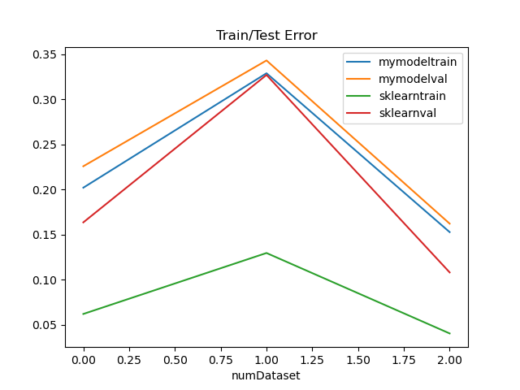
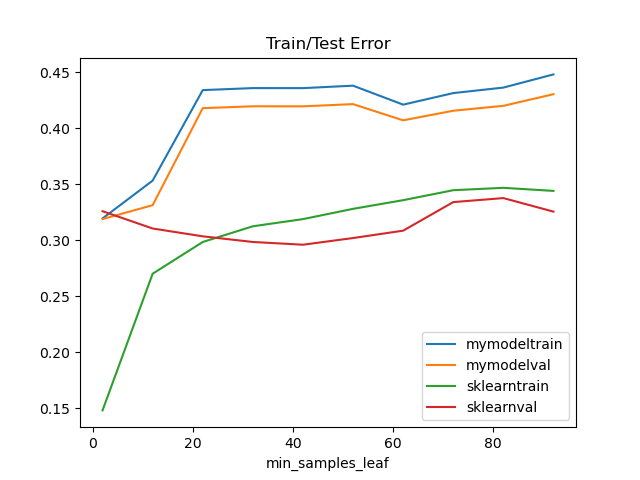
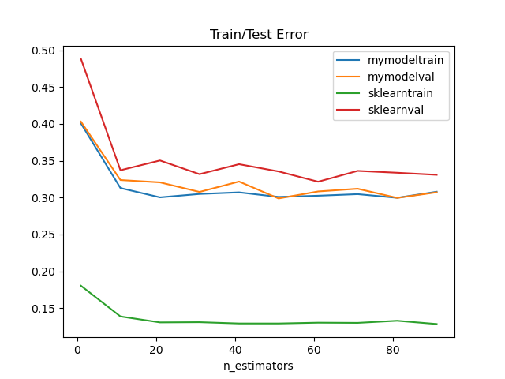

# Random Forest from Scratch
This project tries to recreate the random forest regressor model of sklearn as a programming exercise. 
The created model is then benchmarked together with the standard regressor from sklearn to see how succeessful the implementation was in comparison.
As a final point, I want to analyze how sklearns implementation differs from mine and how that results in the benchmark differences.

# Benchmarks

# Datasets
First we compare the base performance of both models with three datasets:

# Finetuning Parameters
We test the behaviour of both the train and validation error as well as the runtime of the models given different model finetuning parameters, while keeping all else equal:

## ccp_alpha

cost-complexity pruning prunes the Trees in order to reduce complexity, which hopefully leads to less overfitting.
My model doesn't seem to benefit very much from the pruning, however it also fits a lot less to the training set than the sklearn model, so of course there won't be a benefit.
Sklearn's ccp increases training error by a lot, while very slightly increasing validation performance.
Runtime is unaffected for sklearn, while my model has lower training time for aggressive pruning, which doesn't make any sense to me.

## min_samples_leaf

min_samples_leaf specifies that leaves of the individual decision trees cannot have less than min_samples_leaf amount of leaves. 
This is supposed to reduce overfitting, because the model cannot fit to every single training example exactly.

My model just gets worse in both training and validation error, while sklearns model gets a slight boost to validation performance up to a point, until it reverses again.
Runtime is unaffected for sklearn, while runtime goes to zero for my model after a certain point. My model's is actually the expected behaviour, 
so I suspect sklearn has safeguards against underfitting/not fitting at all.

## min_samples_split

min_samples_split determines that nodes below min_samples_split are not split any further and therefore become leaves of the tree. This has a similar effect to min_samples_leaf.
Unsurprisingly, the graphs look basically the same for the two models.

## n_estimators

n_estimators refers to the number of trees that are averaged over in the random forest model to build a random forest regressor.
The number of estimators reduces train and validation error for both models, but sklearn doesn't have much of a penalty for increasing estimators, while my model's runtime explodes.
This is very likely due to lack of parallelization on the part of my model, while sklearn naturally does have parallelization.

## n_jobs

# Determining feature importances:

## Differences